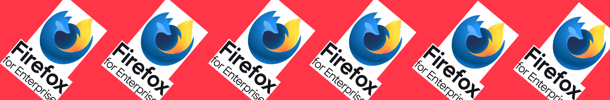

[Firefox](https://firefox.com/) is a fast, reliable and private web browser from the non-profit [Mozilla organization](https://mozilla.org/).

### Contributing

To learn how to contribute to Firefox read the [Firefox Contributors' Quick Reference document](https://firefox-source-docs.mozilla.org/contributing/contribution_quickref.html).

We use [bugzilla.mozilla.org](https://bugzilla.mozilla.org/) as our issue tracker, please file bugs there.

### Resources

* [Firefox Source Docs](https://firefox-source-docs.mozilla.org/) is our primary documentation repository
* Nightly development builds can be downloaded from [Firefox Nightly page](https://www.mozilla.org/firefox/channel/desktop/#nightly)

If you have a question about developing Firefox, and can't find the solution
on [Firefox Source Docs](https://firefox-source-docs.mozilla.org/), you can try asking your question on Matrix at
chat.mozilla.org in the [Introduction channel](https://chat.mozilla.org/#/room/#introduction:mozilla.org).
line 1
line 2
line 3
line 4
line 5
line 6
line 7
line 8
line 9
line 10
line 11
line 12
line 13
line 14
line 15
line 16
line 17
line 18
line 19
line 20
line 21
line 22
line 23
line 24
line 25
line 26
line 27
line 28
line 29
line 30
line 31
line 32
line 33
line 34
line 35
line 36
line 37
line 38
line 39
line 40
